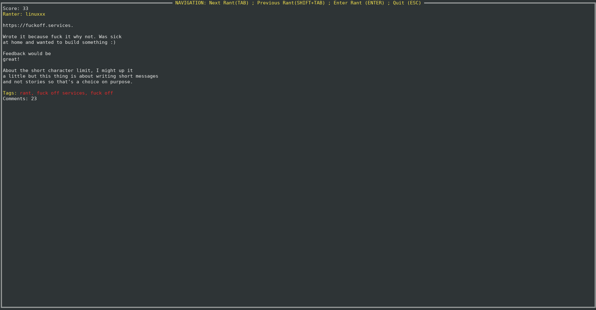
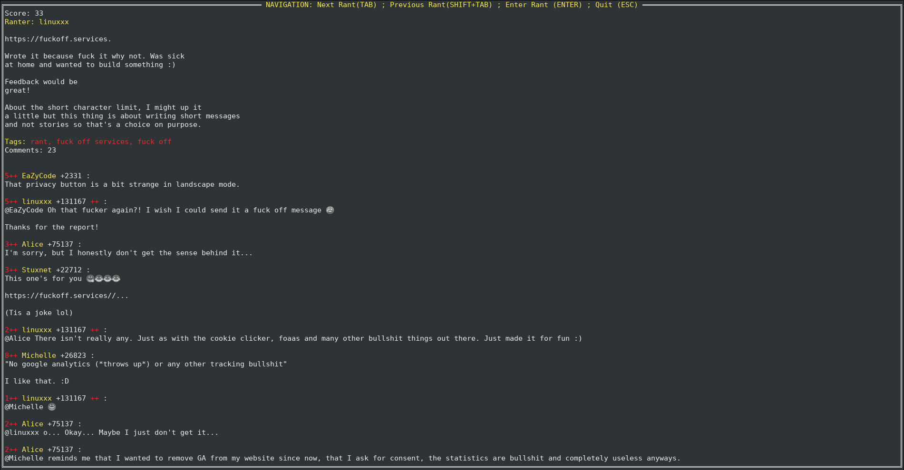

# termRant
A wrapper around https://github.com/Jay9596/goRant  
To navigate through [devRant](https://www.devrant.com) directly in the terminal.

  

## Table of Content
1. [Installation](#Installation)
2. [Documentation](#Documentation)
3. [Getting Started](#Getting-Started)

## Installation:

### Dependency
 
 - [Go](https://golang.org/) - version 1.10 or above required.  
 - [goRant](https://www.github.com/Jay9596/goRant)  
 - [tview](https://github.com/rivo/tview)  
 - [tcell](https://github.com/gdamore/tcell)  

### To compile and run
 * Clone this repo  
   ` git clone https://github.com/rbarcante/termRant.git `  
   ` cd termRant `
 * Install Dependencies  
   ` go get github.com/Jay9596/goRant `  
   ` go get https://github.com/rivo/tview`  
 * Run main.go  
   ` go run main.go `
 * Build and Run  
   ` go build `  
   ` ./termRant `
 * Install  
   ` go install github.com/rbarcante/termRant.git `  

## Getting Started
 `TAB`
 Moves to the next rant  
 `ENTER`
 Fetches the current rant comments  
 `SHIFT+TAB`
 Moves to the previous rant  
 `UP` and  `DOWN` or `MOUSE WHEEL` to navigate to comments if there are too many
 
 It fetches 5 rants by default and fetches the next 5 after reaching the last one  
 The comments might take a while to load on rants with many comments, tested with 40 comments and it took ~5 seconds.  
 
 Have fun , feedback is appreciated.

